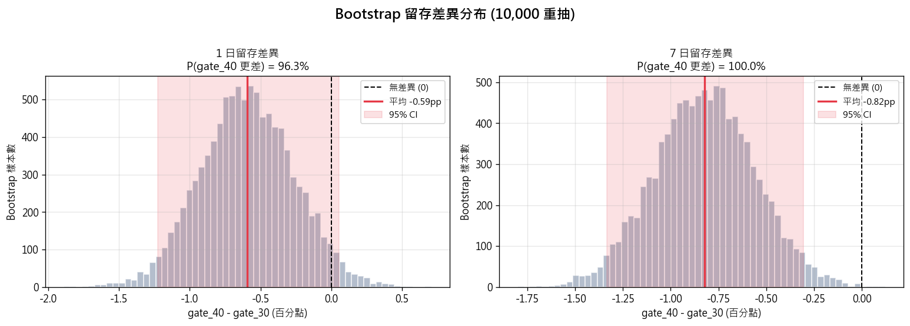
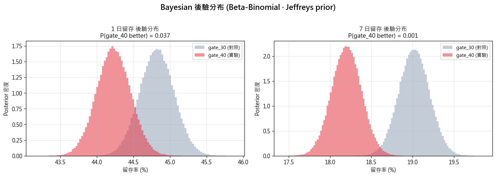
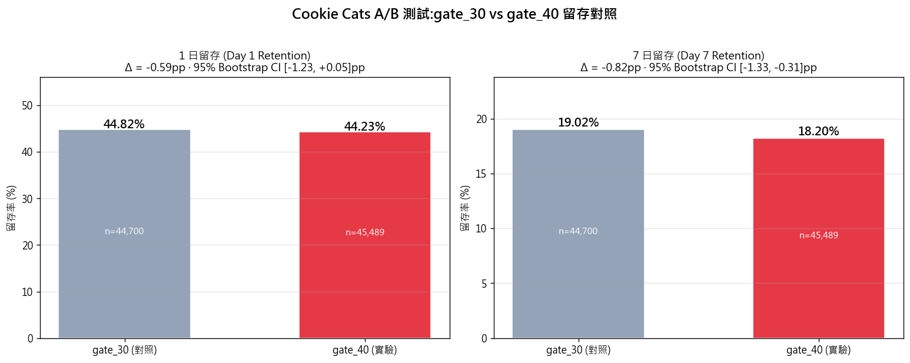

# Cookie Cats A/B 測試 — 該不該移動關卡門檻?

> Tactile Games 把 Cookie Cats 卡關門檻從第 30 關移到第 40 關,測試對留存的影響。
> 用 **Frequentist + Bootstrap + Bayesian** 三種方法分析 90,189 名玩家,給 PM 明確 ship/no-ship 建議。

**🚀 [互動式 Dashboard (Streamlit)](https://cookie-cats-jenho.streamlit.app/)** · **📑 [面試簡報 PDF](slides/portfolio.pdf)** · **📊 [姊妹作:Olist 電商分析](https://github.com/kengkeng44/olist-project)**

**TL;DR**
1. 🚨 **實驗有 SRM (Sample Ratio Mismatch) 異常,p=0.0086** — 嚴格來說結果不該採信,先請工程查 randomization
2. **若硬要解讀**:gate_40 (實驗組) 在 7 日留存顯著更差 (-0.82pp, p=0.0016, Bayesian P(better)=0.001) → **不要 ship**
3. 直覺「移後門檻 → 不被卡 → 留存更高」**被推翻** — 門檻可能扮演承諾機制 (commitment device)

---

## 一、為什麼選這個案子?

PM 履歷常見的資料分析多半止步於描述性統計(RFM、留存分布)。我這個專案展示**實驗設計與評估**。

**而且,我刻意挑了一個 SRM fail 的案例。**

業界 6-10% 線上實驗會 SRM fail(Microsoft Exp 平台 paper, Fabijan et al. 2019),這不是冷門狀況,是 PM 的日常。挑乾淨數據集只能 demo「會跑 t-test」——挑會出問題的數據集才能 demo:

1. **我會抓 SRM** — 多數 PM 履歷直接看 p-value,我第一步先檢查實驗效度
2. **我會處理 SRM fail 的決策** — 不藏不忽略,明確標註 limitation,給 contingency plan
3. **同時還能 demo 三種統計方法** — Frequentist / Bootstrap / Bayesian 交叉驗證,而非因 SRM fail 就停手什麼都不做

這三件事在我看來才是 senior PM 的真正分水嶺。

領域上刻意挑遊戲產業(vs 我[Olist 專案](https://github.com/kengkeng44/olist-project)的電商),補 portfolio 廣度。

---

## 二、資料來源

| 項目 | 內容 |
|---|---|
| 來源 | [Mobile Games A/B Testing (Kaggle)](https://www.kaggle.com/datasets/yufengsui/mobile-games-ab-testing) |
| 公司 | Tactile Games(丹麥手遊公司) |
| 遊戲 | Cookie Cats(連連看 + 解謎,> 100M 下載) |
| 樣本 | 90,189 名玩家 |
| 觀察窗 | 安裝後 14 天 |

| 欄位 | 說明 |
|---|---|
| `userid` | 玩家 ID |
| `version` | `gate_30`(對照)/ `gate_40`(實驗) |
| `sum_gamerounds` | 14 天內玩了幾關 |
| `retention_1` | 安裝後第 1 天是否回來玩 |
| `retention_7` | 安裝後第 7 天是否回來玩 |

**實驗設計**:把首次卡關門檻從第 30 關移到第 40 關。卡關後玩家必須等待或付費才能繼續。

**業務假設(實驗前的直覺)**:玩家少被卡 → 留存應提升。

---

## 三、🚨 第一步:實驗完整性檢查 (SRM)

任何 A/B 測試結果出來,**第一件事不是看指標,是檢查實驗本身**。

### Sample Ratio Mismatch (SRM) Test

理論上 50/50 隨機分配,實際:

| 組別 | 玩家數 | 比例 |
|---|---:|---:|
| gate_30 (對照) | 44,700 | 49.56% |
| gate_40 (實驗) | 45,489 | 50.44% |

對 50/50 跑 chi-square test:**χ²=6.90, p=0.0086 < 0.01 → SRM 異常**

### 為什麼這很嚴重

SRM 違規通常代表 **randomization 有 bug**,例如:
- 某種裝置 / 地區 / 版本只進其中一組(造成樣本偏差)
- Bot 流量沒過濾乾淨(影響某組)
- 分流邏輯 race condition(早期請求進不到一組)

**業界標準** (Microsoft, Google, Airbnb 等):**SRM p-value < 0.01 的實驗結果不該採信**,要先找出 root cause。

### PM 該怎麼做

1. 先請工程 debug randomization service / SDK
2. 確認 SRM 修好之前,**結果先別 share 給 leadership**(避免根據錯資料下決策)
3. 若 root cause 是「特定 cohort 被排除」,可考慮做 sub-population 分析(只看 stable 的子群)

---

## 四、若忽略 SRM 強行分析:三種方法

### Method 1 — Frequentist 2-proportion z-test

| 指標 | 對照 (gate_30) | 實驗 (gate_40) | 差異 | p-value | 95% CI | Cohen's h |
|---|---:|---:|---:|---:|---|---:|
| Day 1 retention | 44.82% | 44.23% | **-0.59pp** | 0.074 | [-1.24, +0.06] | -0.012 |
| Day 7 retention | 19.02% | 18.20% | **-0.82pp** | **0.0016** | [-1.33, -0.31] | -0.021 |

- **Day 1**:邊緣不顯著 (p=0.074),95% CI 包含 0
- **Day 7**:**顯著差異** (p=0.0016),95% CI 完全在 0 以下
- Cohen's h 都是「微小效應」(< 0.2),但因為樣本大,小效應也能達到統計顯著

### Method 2 — Bootstrap 重抽 (10,000 次)

非參數方法,不假設分布形狀。對每個 metric 重抽 10,000 次計算差異:



| 指標 | 平均差異 | 95% Bootstrap CI | P(gate_40 更差) |
|---|---:|---|---:|
| Day 1 retention | -0.59pp | [-1.23, +0.05]pp | **96.3%** |
| Day 7 retention | -0.82pp | [-1.33, -0.31]pp | **100%** |

**Day 7 全部 10,000 次重抽都顯示 gate_40 更差** — 這個結果非常 robust。

### Method 3 — Bayesian Beta-Binomial

用 Jeffreys prior `Beta(0.5, 0.5)`,200,000 次後驗抽樣:



| 指標 | P(gate_40 better) | 95% Credible Interval |
|---|---:|---|
| Day 1 retention | **3.7%** | [-1.24, +0.06]pp |
| Day 7 retention | **0.1%** | [-1.33, -0.31]pp |

Bayesian 給的是「gate_40 比較好」的**直接機率**(Frequentist 無法這樣解讀 p-value)。
**Day 7 只有 0.1% 機率 gate_40 更好** — 業務決策上等於確定不該 ship。

---

## 五、留存對照圖



注意:「視覺上看起來只差一點點」可能讓人誤判。實際上對 Cookie Cats 規模(每日新裝 ~10 萬、留存 1pp 差異 = 30,000 玩家/月),這個 -0.82pp 一點都不小。

---

## 六、Power Analysis(post-hoc)

| 指標 | 觀察到的 power | MDE (80% power) |
|---|---:|---:|
| Day 1 retention | 0.43 (under-powered) | ±0.93pp |
| Day 7 retention | 0.89 (足夠) | ±0.74pp |

- **Day 1 是 under-powered** (只有 43% 機率偵測到 0.59pp 差異) — 結論為什麼會「不顯著」很可能是樣本不夠
- **Day 7 power 足夠** → 結論可信

下次同類實驗,若 PM 想抓 ±0.5pp 的差異,需要至少 **180,000 玩家/組** (現在的 4 倍)。

---

## 七、PM 決策建議

### 對這個實驗
1. **不要 ship gate_40**:7 日留存統計顯著更差,Bayesian P(better)=0.001
2. **修 SRM**:回去查 randomization,修完重跑實驗
3. **重跑時樣本量加大 4 倍**:才有 power 偵測 1pp 級別的 Day 1 差異

### 對「為什麼門檻往後移反而更差」的假設

實驗結果與業務直覺相反,值得 PM/設計團隊深思:

| 假設 | 為什麼可能成立 | 怎麼驗證 |
|---|---|---|
| **門檻是承諾機制** | 卡關產生「未完成感」,玩家會回來繼續 | 比較卡關玩家 vs 未卡關玩家的長期留存 |
| **門檻是 IAP 觸發點** | 第 30 關是「願付費」的最佳時機,移到 40 關錯失轉換 | 看 ARPU / 付費轉換率(資料未提供) |
| **門檻是話題催化** | 卡在某關的玩家會去查攻略 / 找朋友問 → 提升黏著 | 看社群行為 / 攻略搜尋量(資料未提供) |

### 對下一個實驗的設計建議

1. **測 gate_35** — 看是否有甜蜜點(線性外推 30 → 40 變差,可能 35 也不對,但要驗)
2. **測「移除 gate 但加每日任務」** — 用每日任務取代強制卡關,維持承諾感但減少挫折
3. **加分群分析** — 新手 (Day 1-3) vs 老玩家可能反應不同
4. **加營收指標** — 留存差但 ARPU 高也可能 ship,目前資料不足以判斷

---

## 八、為什麼這個專案值得放履歷

| 你能從中看到 PM 候選人會 | 這個專案怎麼展現 |
|---|---|
| 主動選難題而非藏難題 | **刻意挑 SRM fail 的案例**,demo「會抓 + 會處理 + 會判斷」 |
| 質疑實驗設計而非盲信結果 | 開場就抓 SRM,p=0.0086 |
| 用多種方法交叉驗證 | Frequentist + Bootstrap + Bayesian 三角驗證 |
| 區分統計顯著 vs 業務顯著 | Cohen's h、MDE、Power 一起看 |
| 把直覺被推翻當禮物而非威脅 | 「門檻是承諾機制」三個假設 + 驗證方法 |
| 給可執行的 next step | gate_35、移除 gate+任務、分群分析 |

---

## 九、限制與誠實聲明

1. **資料只有 14 天觀察** — 30/90 日留存效應未測
2. **未量化營收** — 若 gate_40 留存差但 ARPU 高,結論可能反轉
3. **未做 segment 分析** — 新手 vs 老玩家、付費 vs 免費可能反應不同
4. **`sum_gamerounds` 有極端離群值** (max=49,854,顯然是 bot 或 stress test) — 本次未針對 gamerounds 跑 t-test 是因此
5. **Bayesian prior 選 Jeffreys (Beta(0.5, 0.5))** — uninformative,但若有歷史先驗可用 informative prior 提升收斂

---

## 十、技術 Stack

`Python` · `pandas` · `scipy.stats` · `statsmodels` · `numpy.random` · `matplotlib`

統計方法清單:
- `proportions_ztest` — 2-proportion z-test
- `proportion_confint` — Wilson score CI
- `bootstrap resampling` — np.random.choice (10K iterations)
- `Beta-Binomial conjugate` — Bayesian posterior with Jeffreys prior
- `Cohen's h` — 比例的標準化效應量
- `chi-square goodness-of-fit` — SRM check
- `zt_ind_solve_power` — power analysis for 2-proportion test

---

## 如何執行

```powershell
# 1. Clone repo
git clone https://github.com/kengkeng44/cookie-cats-ab-test.git
cd cookie-cats-ab-test

# 2. 安裝依賴
pip install -r requirements.txt

# 3. 從 Kaggle 下載資料(需 Kaggle API token)
kaggle datasets download -d yufengsui/mobile-games-ab-testing -p data --unzip

# 4. 執行分析
python notebook/analysis.py
```

產出在 `output/`:
- `summary.csv` — 主要統計結果
- `retention_compare.png` — D1/D7 留存對照
- `bootstrap_dist.png` — Bootstrap 差異分布
- `posterior.png` — Bayesian posterior
- `gamerounds_dist.png` — 遊戲輪數分布
- `decision.md` — PM 決策建議

---

## 資料授權

來源:[Mobile Games A/B Testing (Kaggle)](https://www.kaggle.com/datasets/yufengsui/mobile-games-ab-testing) · 授權狀態 unknown(Kaggle 標示)
本專案目的:作品集 / 教學用途,非商用

---

## 延伸閱讀

- [Diagnosing Sample Ratio Mismatch in Online Controlled Experiments — Microsoft Research](https://www.microsoft.com/en-us/research/group/experimentation-platform-exp/articles/diagnosing-sample-ratio-mismatch-in-online-controlled-experiments/)
- [Trustworthy Online Controlled Experiments (book)](https://experimentguide.com/) — Kohavi, Tang, Xu
- [Bayesian A/B Testing — Evan's Awesome A/B Tools](https://www.evanmiller.org/bayesian-ab-testing.html)
- [我的 Olist 電商分析 portfolio](https://github.com/kengkeng44/olist-project)
